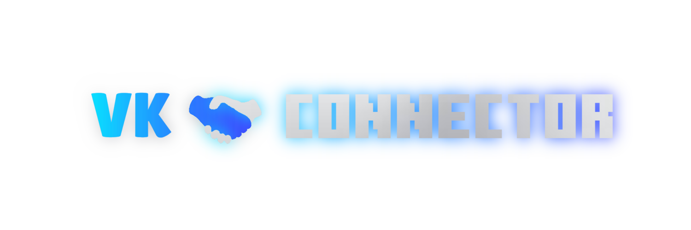

**ВКонтакте 🤝 MINECRAFT**

## Описание 📒
Проект который позволяет привязать игровой аккаунт к боту **ВКонтакте**.
Может работать как с версией игры **1.20**, так и с версией **1.1**.
Через бота можно будет частично управлять сессией на сервере.

## Планы 🎯
- [ ] Добавить побольше функциональности в бота.
- [ ] Увеличить скорость работы и значительно поработать с оптимизацией.
- [ ] Добавить расширенный API чтобы другие плагины могли интегрировать с данным проектом.
- [ ] Значительно улучшить безопасность.

  Ещё что-то...

## Предупреждение ⚠
Данный проект находится на этапе тестирования и может работать некорректно в некоторых местах! Если вы обнаружили ошибку или недостаток, сообщите об этом в разделе **[ISSUES](https://github.com/Taskov1ch/VkConnector/issues)**. Спасибо за понимание!

## Полезные ссылки 🔗
- [Инструкция по установке](dont_touch_me/installation.md)
- [Скриншоты](https://drive.google.com/drive/folders/1h7pNQpwYZ1c3OcifHx15sD8A0lW4akCG)
